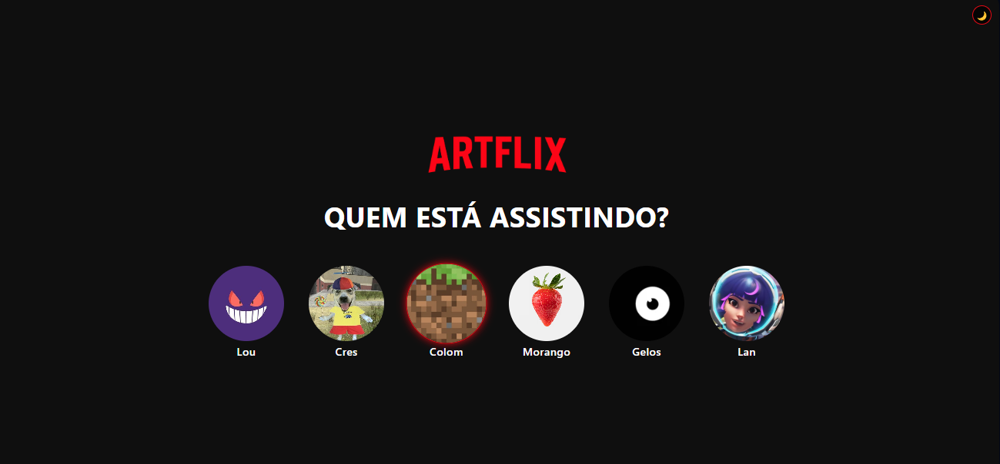
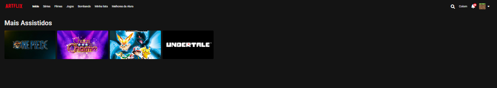

# Quem Está Assistindo? 🎬

**Interface de seleção de perfis inspirada em plataformas de streaming, desenvolvida durante a [Imersão Front-End IA da Alura](https://www.alura.com.br/).**


## ✨ Funcionalidades

- 👥 Cards de perfil interativos com hover effects
- 📱 Design responsivo mobile-first (375px+)
- ✨ Animações suaves com CSS `@keyframes`
- 🎨 Design System moderno com variáveis CSS
- 🔍 Navegação por teclado acessível
- 🎯 Efeito de seleção de perfil ativo

## 🛠️ Tecnologias

```html
HTML5 | CSS3 | JavaScript
```

## 📱 Responsivo

| Dispositivo | Resolução | Status |
|-------------|-----------|--------|
| Mobile | 375px+ | ✅ |
| Tablet | 768px | ✅ |
| Desktop | 1200px+ | ✅ |

## 🎯 Conceitos praticados

- Layout com Flexbox e CSS Grid
- Animações CSS avançadas
- Pseudo-classes (`:hover`, `:focus`, `:active`)
- Design System com CSS Custom Properties
- Acessibilidade (ARIA labels, keyboard navigation)
- Responsividade com media queries

## 📚 Feito durante

[](https://www.alura.com.br/)


# Screenshots




